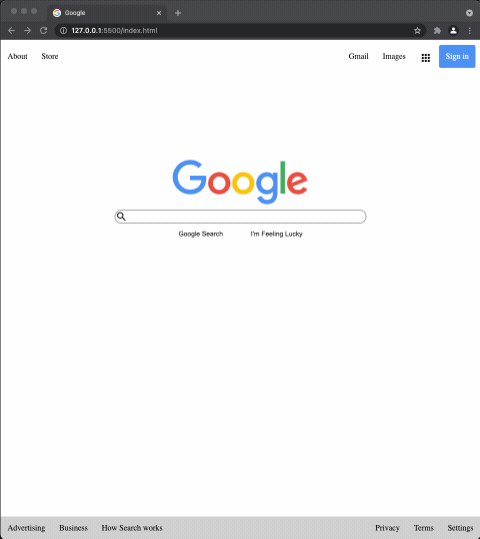

# Google Homepage

From [the Odin Project](http://www.theodinproject.com/courses/web-development-101/lessons/html-css)'s HTML/CSS curriculum.

This is my attempt at building a clone of an existing Internet page with the use of Chrome DevTools. The links are not meant to work, it's only to practice html and css skills.

[Live Demo](https://kamyar-mazloom.github.io/weather-app/) :point_left:

